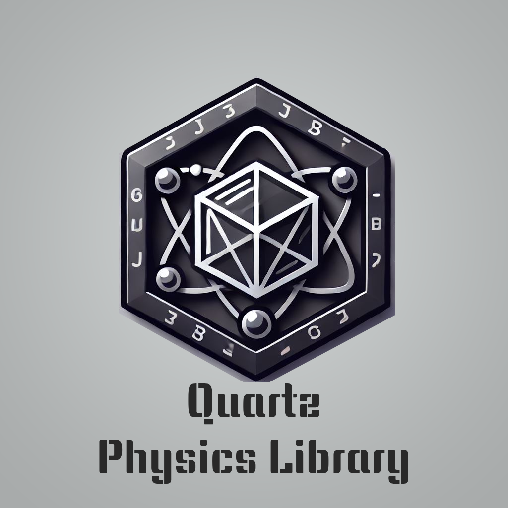

# Quartz Physics V0.1

The first comprehensive Java physics Library

Supported features:

- **Rigid Body Simulations**
    - **Force**
    - **Torque**
    - **Drag**
    - **Friction**

- **Collision**

